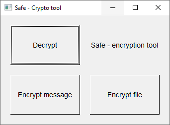
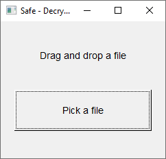
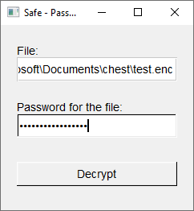
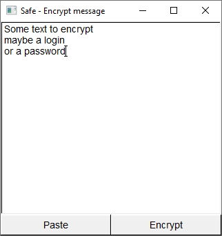
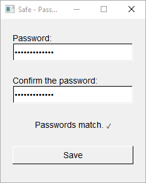

# Safe - encryption tool
### About
This is a very simple encryption tool I made for my relatives, so that they would be able to keep their secrets secret. Since most encryption tools (including passsword managers) were too complicated for them to understand and use I made something very simple. It's litteraly just an encryption tool, it does  nothing else. It also has a partially working commandline interface in addition to GUI for the pros, but it's not finished.

This project is old and badly done, if you're interested in simple symmetric encryption tools there are tools like:
- [sym](https://github.com/matdlu/sym), another tool written by me I use daily (command line)
- [age](https://github.com/FiloSottile/age), popular tool which is fine (command line)
- And the only normie friendly alternative I know is 7zip encryption.

### Screenshots


Main menu



After clicking "Decrypt" from the main menu



Decryption box



After clicking "Encrypt message" from the main menu



Encryption box

### Usage
Interface is I guess self-explanatory. 

One thing which may require explaining is the difference between "Encrypt message" and "Encrypt file" is what happens on decryption and conveniance.
For example when you encrypt a message, a popup will open allowing you to edit the message.
Whereas when using the "Encrypt file" button after decryption a popup will show up which just allows you to save the decrypted file somewhere.

### Crypto
AES256 in CTR mode for file encryption and argon2id as PBKDF.

### Dependencies
Binaries included in the project should work... but here is the dependency information:
- fltk
- libsodium

### Building
Compiles using MinGW on Windows and on linux. If compilation does not work you can try with other depenency modes in CMakeLists.txt.
```
mkdir build
cd build
cmake ..
make
```

### Disclaimer
This project contains bad code style, cryptic names, including headers inside the code... huge cmake script to try to make things automated and easy (which very likely does the opposite), no seperation of model from the presentation, manual "layout", bad UI design... But it works :D
